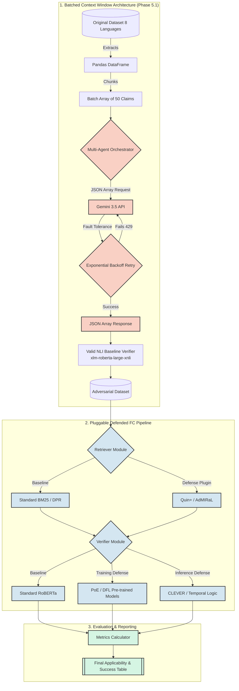

# Unified Adversarial Testing Framework Architecture

To integrate both attacks (which happen dynamically) and defenses (which can be baked into training or applied at inference) into a single system, you need a **Modular Component Architecture**. 

Instead of writing a single script, you build a framework where Retrievers, Verifiers, and Attackers are treated as interchangeable "plugins".

## System Architecture Diagram



## Core Components

### 1. The Model Zoo (For Training-Time Defenses)
Defenses like **PoE** (Product of Experts) and **DFL** (Debiased Focal Loss) must be applied during training. 
* **Design:** You pre-train these models offline. Your system has a "Model Zoo" folder containing `baseline_roberta.pt`, `poe_roberta.pt`, and `dfl_roberta.pt`. 
* **Integration:** When configuring a test run, the system simply loads the requested model weights from the zoo.

### 2. The Pluggable Pipeline (For Inference-Time Defenses)
Defenses like **Quin+** (retrieval) or **CLEVER** (verification logic) run live.
* **Design:** Use an Object-Oriented approach. Define a standard `Retriever` class and `Verifier` class. 
* **Integration:** 
  ```python
  # Standard Run
  pipeline = FCPipeline(retriever=BM25(), verifier=StandardBERT())
  
  # Defended Run
  pipeline = FCPipeline(retriever=QuinPlus(), verifier=CLEVER())
  ```

### 3. The Attack Orchestrator
This manages the 53 attacks across 8 languages.
* **Design:** A single dispatcher that takes an input claim, an `attack_type`, and a `language_code`. It routes rule-based attacks to your local Python functions and generative attacks to an LLM API.
* **Integration:** It outputs a standardized JSON adversarial dataset that is completely decoupled from the fact-checking models, meaning you can generate the attacks once and test them against 10 different defense configurations without regenerating them.

## Workflow of an Integrated Experiment

1. **Configuration:** The Orchestrator automatically targets the 8 Indic language datasets (e.g. Hindi, Malayalam, Urdu) and the 53 loaded Attack Agents.
2. **Batched Attack Generation:** The Orchestrator chunks the dataset into 50-row batches. It prompts Gemini to apply the attack (e.g., `Fact Mixing`) across all 50 claims simultaneously, safely retrying via exponential backoff if the Free-Tier limit is hit.
3. **Baseline Verification:** The adversarial claims are passed to the valid NLI Baseline Verifier (`xlm-roberta-large-xnli`) to mathematically calculate the drop in Entailment vs. Contradiction.
4. **Defense Assembly (Phase 6):** Once the defense descriptions are uploaded, the system dynamically wraps the NLI Verifier with the specified defense (e.g., `CLEVER` or `DFL_Model`).
5. **Reporting:** The Orchestrator compiles the cross-matrix of every attack, against every language, with and without defenses, saving the success rates to `evaluation_report.csv` for the Gradio UI.
